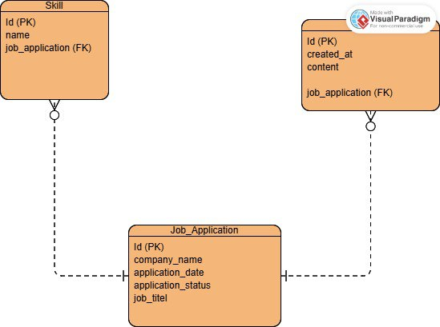

# Darbak - (دربك)

Darbak is a job application tracking web app that helps users stay organized during their job search journey. Users can securely create an account, add and edit job applications, attach notes and skills for each job, and monitor their progress all in one place. Authentication ensures that each user's data is protected and private.
## Repository Description

This repository contains the backend source code of the application, built using Django and Django REST Framework. The project is organized to separate core functionality, API logic, and configuration.

### Folder Structure

- **`main_app/`**  
  Core Django app containing all backend logic:
  - `models.py` – Defines the data models (database schema).
  - `serializers.py` – Converts model instances to JSON and handles validation.
  - `urls.py` – Maps API endpoints to views.
  - `admin.py` – Registers models for access in the Django admin panel.
  - `views.py` – Contains class-based views for handling GET, POST, PATCH, and DELETE requests.

- **`backend-darbak/`**  
  Django project configuration:
 - `settings.py` – Defines project settings including installed apps, middleware, database configuration, authentication, and more.

## Tech Stack

### Languages & Frameworks
- **Python** – Main programming language
- **Django** – Web framework for building the backend
- **Django REST Framework** – Toolkit for building Web APIs

### Libraries & Packages
- **djangorestframework-simplejwt** – Handles JWT authentication
- **psycopg2-binary** – PostgreSQL database adapter for Python
- **django-cors-headers** – Manages Cross-Origin Resource Sharing (CORS)

### Tools & Services
- **PostgreSQL** – Relational database used for storing application data
## ERD Diagram

## Frontend Repository
You can find the frontend code here: [Frontend Repository Link](
    https://git.generalassemb.ly/ebtisam010/front-darbak
)
## RESTful Routing Table for both Client and Server

## Backend Routing Table (Server-Side - Django URLs)

| Route Name        | Method        | URL                            | Description                                 |
|-------------------|---------------|--------------------------------|---------------------------------------------|
| index             | GET           | api/jobs/                    | Display all job applications                |
| create            | POST          | api/jobs/                    | Create a new job application                |
| show              | GET           | api/jobs/<int:pk>/          | Display details of a specific job           |
| update            | PUT/PATCH     | api/jobs/<int:pk>/          | Update a specific job                       |
| destroy           | DELETE        | api/jobs/<int:pk>/          | Delete a specific job                       |
| index             | GET           | api/notes/                   | Display all notes                           |
| create            | POST          | api/notes/                   | Create a new note                           |
| show/update/delete| GET/PUT/PATCH/DELETE | api/notes/<int:pk>/   | View, update, or delete a specific note     |
| index             | GET           | api/skills/                  | Display all skills                          |
| create            | POST          | api/skills/                  | Create a new skill                          |
| signup            | POST          | api/signup/                  | Register a new user                         |
| login             | POST          | api/token/                   | Login and obtain JWT token                  |

## Frontend Routing Table (Client-Side – React Router)

| Path              | Component   | Description                     |
|-------------------|-------------|---------------------------------|
| /               | Welcome     | Landing page                    |
| /login          | Login       | User login page                 |
| /logout         | Logout      | User logout page                |
| /signup         | Signup      | User registration page          |
| /home           | Home        | Main homepage      |
| /jobs/add       | JobAdd      | Form to create a new job        |
| /jobs/:id       | JobDetail   | Details for a specific job      |
| /jobs/:id/edit  | JobEdit     | Edit a specific job             |
| *               | NotFound    | Page not found (404)            |

## Icebox Features

- Localization support (Arabic version of the app)
- Job search and filtering
- Reminders for scheduled interviews
- Upload resume for each job
- Color labels for job statuses